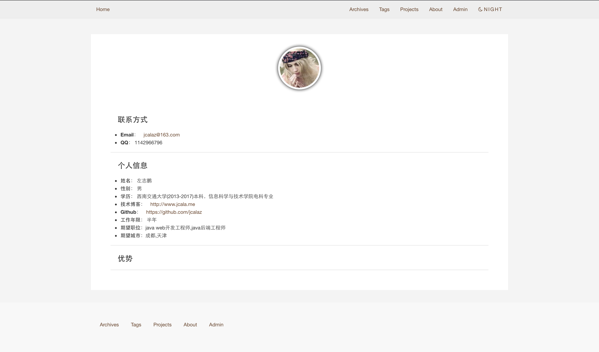
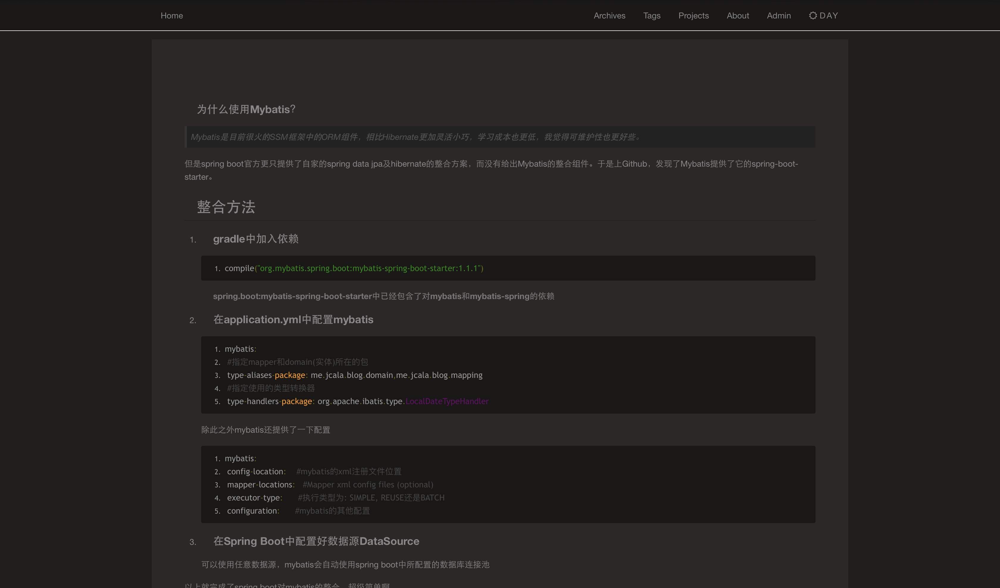
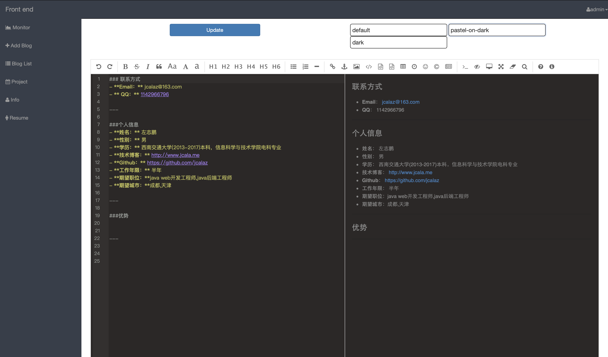
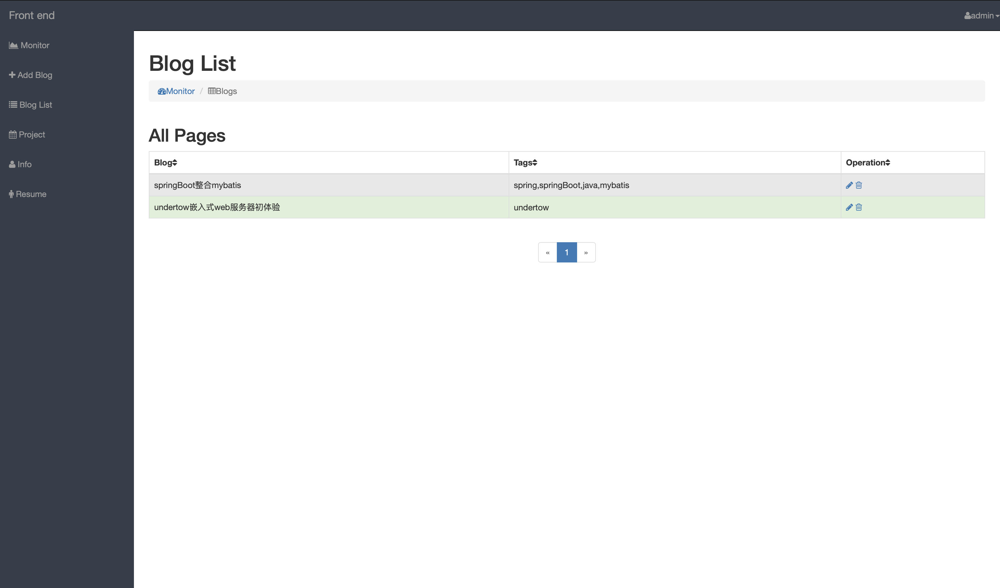

[github地址](https://github.com/)
## 个人博客网站
#### 所用技术:
 - Spring Boot 
 - Spring MVC: MVC框架
 - Tomcat: web容器
 - Spring Data JPA: ORM框架
 - Thymeleaf: 模板引擎
 - lombok: 工具
 - quartz: 定时任务
 - ehcache: 缓存
 - bootstrap: css/html框架
 - [editor.md: markdown编辑器](https://github.com/pandao/editor.md)
 - mysql:数据库
---
#### 预览

---
##### 一键黑夜模式

---
##### 后台管理

